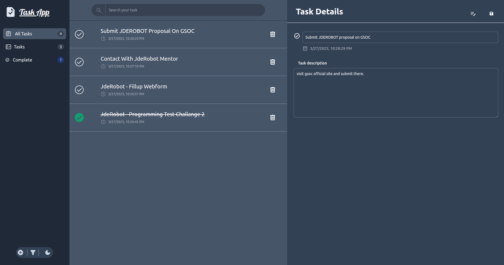

<br />
<div align="center">
  <a href="https://github.com/othneildrew/Best-README-Template">
    
  </a>

  <h3 align="center">JdeRobot React Task App</h3>

  <p align="center">
    This task app build with reactjs to complete programming test.
    <br />
    <a href="https://exquisite-parfait-ebaded.netlify.app/" target="_blank">View Demo</a> 
    
  </p>
</div>

<!-- ABOUT THE PROJECT -->

## About The Project

This app has basic functionality of a task app.
</br>



<!-- GETTING STARTED -->

## Getting Started

This app built with react js.

### Prerequisites

This software need available on your local computer to run the app.

-   nodejs
-   npm
-   git

### Installation

1. Clone the repo
    ```sh
    git clone https://github.com/codezerro/jderobot-task-app.git
    ```
2. Install NPM packages
    ```sh
    npm install
    ```
3. Run the app
    ```sh
    npm run start
    ```
4. Build the app (optional: if you want build the app)
    ```sh
    npm run build
    ```

<!-- CONTACT -->

## Contact

Md.Shariar Kabir - [@linkedin](https://www.linkedin.com/in/md-shariar-kabir-238171160/)
